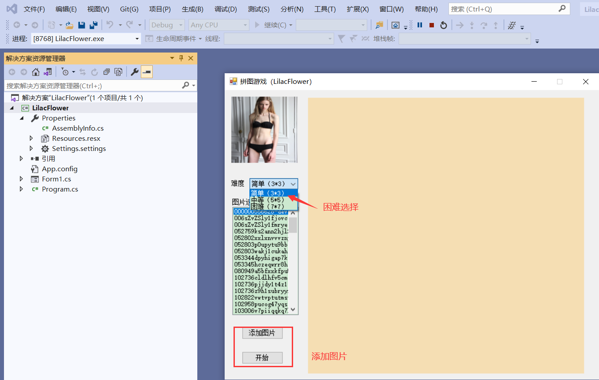

# windows拼图游戏项目

本项目使用C#开发，可以使用Visual Studio 2012、2013、2015、2017、2019运行，推荐您使用Visual Studio 2019运行，运行目录文件夹下：**LilacFlower.sh** 运行，根据提示安装相应的Visual Studio 2019中关于C#的支持。

### 文章地址：

https://bamboo.blog.csdn.net/article/details/116535908

### 项目截图：

### 游戏难度

游戏分为三个难度，简单、普通、困难。其中简单是3x3的九宫格，后面两个是5x5，以及7x7的模式。

目录下：LilacFlower\LilacFlower\bin\Debug\LilacFlower.exe 可以直接运行，效果如上

### 添加图片

关于添加图片的方式有两种第一种是选择添加图片按钮添加一个图片

第一种是，直接讲图片复制到**LilacFlower\LilacFlower\bin\Debug\Image** 重新打开即可

